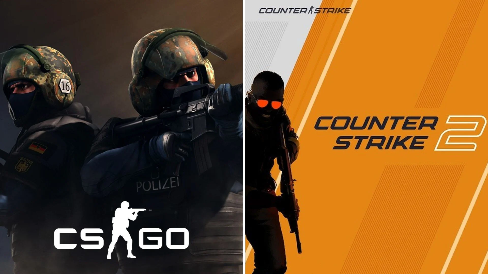
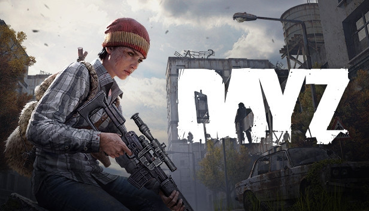

## 🖖 Olá, meu nome é <strong>Alan Henrique!</strong>
<h3>Sou desenvolvedor de sistemas web fullstack e tentando ser gamer e músico 🎸🥹</h3>

<!-- 
  
 -->

- 👨‍🎓 Sou formado em Análise e Desenvolvimento de Sistemas pela Faculdade Anhanguera

- 💻 Todos os meus projetos estão disponíveis [aqui](https://github.com/alanhrc?tab=repositories)

- 📫 Meu e-mail para contato **alancamargo50@gmail.com**

- 🎮 Nas horas vagas, gosto de tocar 🎸 e de jogar:
  ### 

  ### 

#
<h3 align="left">Minhas Redes Sociais: </h3>

<!--  -->
<!--  -->

#
<h3 align="left">Skills: </h3>

   

  

  

#
<h3 align="left">Tools: </h3>

  

#
<h3 align="left">Systems: </h3>

# 
<h3 align="left">📊 Estatísticas</h3>
